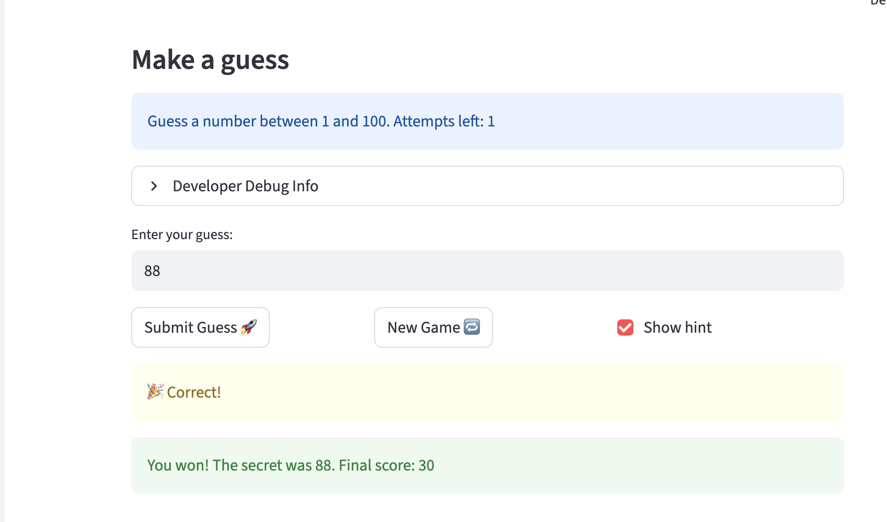

# 🎮 Game Glitch Investigator: The Impossible Guesser

## 🚨 The Situation

You asked an AI to build a simple "Number Guessing Game" using Streamlit.
It wrote the code, ran away, and now the game is unplayable. 

- You can't win.
- The hints lie to you.
- The secret number seems to have commitment issues.

## 🛠️ Setup

1. Install dependencies: `pip install -r requirements.txt`
2. Run the broken app: `python -m streamlit run app.py`

## 🕵️‍♂️ Your Mission

1. **Play the game.** Open the "Developer Debug Info" tab in the app to see the secret number. Try to win.
2. **Find the State Bug.** Why does the secret number change every time you click "Submit"? Ask ChatGPT: *"How do I keep a variable from resetting in Streamlit when I click a button?"*
3. **Fix the Logic.** The hints ("Higher/Lower") are wrong. Fix them.
4. **Refactor & Test.** - Move the logic into `logic_utils.py`.
   - Run `pytest` in your terminal.
   - Keep fixing until all tests pass!

## 📝 Document Your Experience

- [x] Describe the game's purpose.
   - This is a guessing game. It allows a player the limited number of guesses to guess the secret number. Every wrong guess goes with the hint (lower or higher) to help the player win the game 
- [x] Detail which bugs you found.
   - The first bug I found is that the attemp left display is inaccurate. When the game is over, it still displays as 1 causing confusion to the player
   - The second bug I found is that the hint logic is implemented incorrectly. It randomly says higher and lower despite the fact that whatever the secret number, the guess value, and the range are. For example, the range is 1 to 100.When 1 was entered, it said go lower

- [x] Explain what fixes you applied.
   - For the first bug, I changed the initial attempt from 1 to 0. I also correct the loss condition by changing it from >= to >, so the game ends after limit guesses, not before 
   - The hint message was reversed. To fix this bug, I corrected the message according to the condition between guess and secret number. Also, I removed the type flip on even attemps to prevent secret value from converting to string because string comparisions are lexicographic, causing hints are inconsistent on even-numbered attempts

## 📸 Demo

- [x] [Insert a screenshot of your fixed, winning game here]

## 🚀 Stretch Features

- [ ] [If you choose to complete Challenge 4, insert a screenshot of your Enhanced Game UI here]
